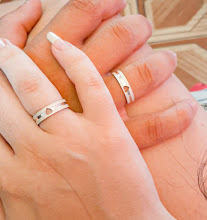

<h1 align="center">
    
</h1>

<h1 align="center"> Voto Perpétuo</h1>

<h1 align="center">
    
</h1>

Esse repositório foi criado para guardarmos nossos projetos em desenvolvimento, além de documentar nosso processo de aprendizado e introdução a novas tecnologias.

  

 

## 🚀 Tecnologias

O projeto possuí as seguintes técnologias:
- HTML
- CSS
- Bootstrap
- JavaScript
- React
- Node.js 
- Typescript 
- Next.js
---

## 📝 Licença

Este projeto está licenciado sob a Licença MIT. Veja o [LICENSE](LICENSE.md) arquivo para obter detalhes.

---

Developed with 💕 by Vinicius Moura && Bruna Silva

